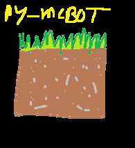

## py_mcbot

This is a simple discord bot to control a minecraft server



## Installation

If you don't have installed uv already
``pip install uv``

Clone the repo

``git clone https://github.com/matter123test/py_mcbot``

``cd py_mcbot``

``uv venv``

## Create papermc server

``uv run python setup/setup.py``

After running this command it will create a folder `server`

Make sure to accept the Eula in `server/eula.txt`

## Configuration

Create a folder name "config"

`bot.config.json` example:

```json5
{
  "token": "bot_token",
  "admins": [
    // example 699192312391
  ]
}
```

`mcrcon.config.json` example:

```json
{
  "host": "localhost",
  "password": "1234",
  "port": 25575,
  "seconds_delay": 1
}
```

`server.config.json` example:

```json5
{
  "server_path": "server folder",
  "server_logs_file_path": "server folder/latest.log",
  // Example command
  "run": [
    "java",
    "-Xmx3G",
    "-jar",
    "server.jar",
    "nogui"
  ]
}
```

Inside the server folder modify the `server.properties`
and set the values:

```properties
enable-rcon=true
rcon.password=1234
rcon.port=25575
```

For cracked player support set online mode to false

```properties
online-mode=false
```

## Run

Run the bot:

``uv run python run.py``
